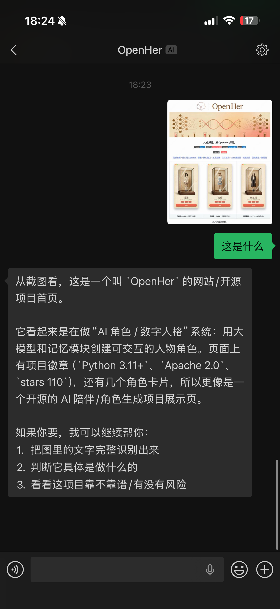
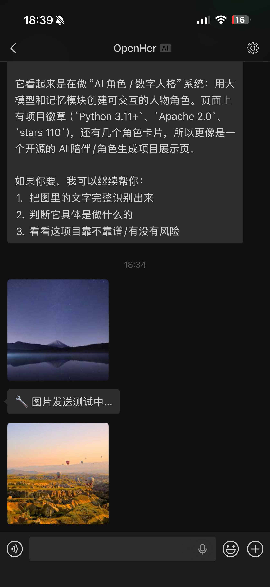

<p align="center">
  
</p>

<h1 align="center">weiclaw</h1>

<p align="center">
  <a href="https://www.npmjs.com/package/weiclaw"></a>
  <a href="https://github.com/kellyvv/weiclaw"></a>
  <a href="LICENSE"></a>
  <a href="https://github.com/kellyvv/weiclaw"></a>
</p>

<p align="center">
  <a href="#quick-start">Quick Start</a> · <a href="#full-multimodal-matrix">Multimodal</a> · <a href="#media-protocol">Media Protocol</a> · <a href="#multi-agent-mode">Multi-Agent</a> · <a href="#proactive-send-api">Send API</a> · <a href="#bring-your-own-agent">Custom Agent</a>
</p>

<p align="center">
  <a href="README.md">中文</a> | English
</p>

> ⭐ If this project helps you, please give it a Star!

**The first open-source project** to support full multimodal bidirectional communication between WeChat and AI Agents — text, images, voice, video, and files, both sending and receiving.

<p align="center">
  
  
  <a href="https://github.com/kellyvv/weiclaw/raw/main/docs/wechat-voice-demo.mp4">
    
  </a>
</p>

## Features

- 🔌 **Zero-config setup** — One `npx` command, no cloning, no configuration
- 🧠 **Agent-agnostic** — Works with any OpenAI-compatible API (Codex / Gemini / Claude / OpenCode / custom)
- 📡 **Full multimodal** — Text, images, voice, video, files — bidirectional
- 🤖 **Multi-Agent** — Connect multiple Agents simultaneously, route with `@` prefix
- ⌨️ **Typing indicator** — Shows "typing..." while Agent is thinking
- 📤 **Proactive Send API** — Agent can push multiple messages to simulate human typing rhythm

### Full Multimodal Matrix

| Modality | WeChat → Agent | Agent → WeChat |
|------|:---:|:---:|
| 📝 Text | ✅ | ✅ |
| 📷 Image | ✅ Auto-detect | ✅ HD original |
| 🎤 Voice | ✅ Speech-to-text | ✅ Voice bubble |
| 🎬 Video | ✅ Auto-receive | ✅ With thumbnail |
| 📄 File | ✅ Content extraction | ✅ Downloadable |
| 💬 Quoted msg | ✅ Auto-extract quoted media | — |

### Supported Agents / Tools

| Agent | Integration | Install |
|-------|------------|---------|
| ⌬ [OpenCode](https://opencode.ai) | `examples/opencode/` template | `npm i -g opencode-ai` |
| 🤖 [OpenAI Codex](https://github.com/openai/codex) | `--codex` | `npm i -g @openai/codex` |
| 💎 [Google Gemini](https://github.com/google/gemini-cli) | `--gemini` | `npm i -g @google/gemini-cli` |
| 🧬 [Claude Code](https://github.com/anthropic-ai/claude-code) | `--claude` | `npm i -g @anthropic-ai/claude-code` |
| 🐾 [OpenClaw](https://github.com/nicepkg/openclaw) | `--openclaw` | `npm i -g openclaw` |
| 🔗 Any OpenAI-compatible API | Pass URL directly | — |
| 📡 [ACP](https://agentcommunicationprotocol.dev/) Agent | `--agent name=acp://...` | — |

## Quick Start

```bash
# Pick your favorite Agent:
npx weiclaw --codex     # OpenAI Codex
npx weiclaw --gemini    # Google Gemini
npx weiclaw --claude    # Claude Code
npx weiclaw --openclaw  # OpenClaw

# Or use example templates for more Agents:
cd examples/opencode && node server.mjs  # OpenCode (free models included)

# Or pass a URL directly:
npx weiclaw http://your-agent:8000/v1
```

> First time: A QR code pops up in terminal → Scan with WeChat → Done. Login is cached automatically.

### Dependencies

```bash
# 1. Node.js >= 22
curl -o- https://raw.githubusercontent.com/nvm-sh/nvm/v0.40.3/install.sh | bash
nvm install 22

# 2. Python 3 + pip
brew install python3       # macOS
apt install python3 python3-pip  # Linux

# 3. ffmpeg
brew install ffmpeg        # macOS
apt install ffmpeg         # Linux

# 4. pilk
pip install pilk
```

## How It Works

```
WeChat User ←→ Tencent ilinkai API ←→ weiclaw ←→ Your Agent (HTTP)
```

Directly calls Tencent's ilinkai API to send/receive WeChat messages. No middleware, no reverse engineering, no web client. Your Agent just needs an OpenAI-compatible HTTP endpoint.

## Bring Your Own Agent

Any language — just expose `POST /v1/chat/completions`:

```python
@app.post("/v1/chat/completions")
def chat(request):
    message = request.json["messages"][-1]["content"]
    reply = your_agent(message)
    return {"choices": [{"message": {"role": "assistant", "content": reply}}]}
```

Then: `npx weiclaw http://your-agent:8000/v1`

## Media Protocol

Include specific formats in Agent responses to automatically send media:

| Type | Agent Response Format | Notes |
|------|----------------------|-------|
| Image | `` | URL, local path, or data URI |
| Voice | `[audio:path or URL]` | MP3/WAV/OGG, requires `ffmpeg` + `pilk` |
| Video | `[video:path or URL]` | Requires `ffmpeg` |
| File | `[file:path or URL]` | Any file type |

**Image receiving** (WeChat → Agent) follows the [OpenAI Vision API](https://platform.openai.com/docs/guides/vision):

```json
{
  "messages": [{
    "role": "user",
    "content": [
      { "type": "text", "text": "What is this?" },
      { "type": "image_url", "image_url": { "url": "data:image/jpeg;base64,..." } }
    ]
  }]
}
```

> Examples: [image-test.mjs](examples/image-test.mjs) · [voice-test.mjs](examples/voice-test.mjs) · [video-test-local.mjs](examples/video-test-local.mjs) · [file-test.mjs](examples/file-test.mjs)
>
> Agent templates: [claude-code](examples/claude-code/) · [opencode](examples/opencode/) · [openai](examples/openai/)

## Multi-Agent Mode

Connect multiple Agents simultaneously, route with `@` prefix. Supports OpenAI format and [ACP](https://agentcommunicationprotocol.dev/):

```bash
npx weiclaw \
  --agent codex=http://localhost:3001/v1 \
  --agent gemini=http://localhost:3002/v1 \
  --agent bee=acp://localhost:8000/chat \
  --default codex
```

| WeChat Message | Effect |
|---|---|
| `Hello` | Sent to default Agent |
| `@codex write a sort` | Routes to Codex |
| `@gemini review code` | Routes to Gemini |
| `@list` | List all Agents |
| `@switch gemini` | Switch default |

## Proactive Send API

Bridge starts an HTTP API on `localhost:9099`. Agents can proactively push multiple messages (simulating human typing rhythm):

```bash
curl -X POST http://localhost:9099/api/send \
  -H "Content-Type: application/json" \
  -d '{"to": "user_id", "content": "Hmm..."}'
```

- `to` — WeChat user ID (bridge passes this via the `user` field when calling agents)
- `content` — Same formats as agent responses (plain text, ``, `[audio:path]`, etc.)
- Use `--port PORT` to customize the port

**Use case**: Agent splits one reply into multiple segments with controlled timing:

```python
import requests, time
def send(to, text):
    requests.post("http://localhost:9099/api/send", json={"to": to, "content": text})

send(user_id, "Hmm...")
time.sleep(1.5)
send(user_id, "Let me think")
time.sleep(2)
# Final segment returned as normal response
```

## Credentials

Login credentials are saved in `~/.weiclaw/credentials.json`. Delete to re-login.

## Star History

If this project helped you, please give it a ⭐ Star — it's the best support!

## License

[MIT](LICENSE)
